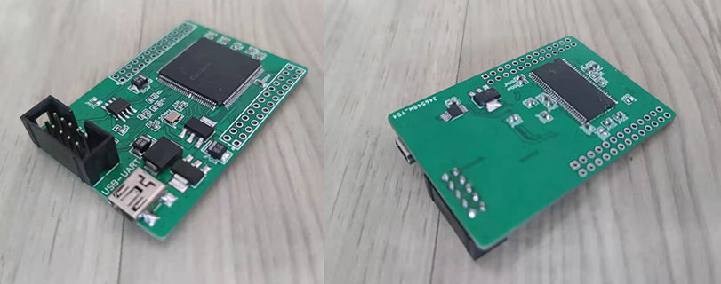
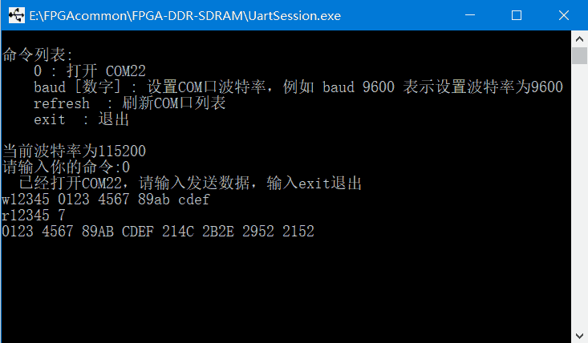

-CAD09D.svg)   

FPGA DDR-SDRAM
===========================
在低端FPGA设计中用 DDR-SDRAM（DDR1）替换 SDR-SDRAM。

# 简介

                          |------------------------------|          |-----------|
                          |                              |          |           |
                    ----->| driving clock and reset      |          |           |
                          |                              |          |           |
    ------------|         |          DDR-SDRAM interface |--------->|           |
                |  AXI4   |                              |          |           |
    AXI4 master |-------->| AXI4 slave                   |          |           |
                |         |                              |          |           |
    ------------|         |------------------------------|          |-----------|
      用户逻辑                       DDR1 控制器                         DDR1 芯片

很多低端 FPGA 开发板使用 SDR-SDRAM 作为片外存储，而 DDR-SDRAM (DDR1) 比 SDR-SDRAM 容量更大，价格更低。且与SDR-SDRAM一样，DDR1也能使用低端FPGA的普通的IO管脚直接驱动。我编写了一个软核的 AXI4 接口的 DDR1 控制器。该控制器的特点有：

* **平台无关** ：纯 SystemVerilog 编写，可以在 Altera 和 Xilinx 等各种 FPGA 上运行。
* **兼容性强** ：支持各种位宽和容量的 DDR1 （已在MICRON所有位宽和容量的DDR1型号上仿真通过）。

为了展示该控制器的使用方法，我提供了两个示例程序：

* **自测程序**：通过DDR1控制器，将数据写入 DDR1 ，然后读出，比较读出的数据是否与写入的吻合。
* **UART读写程序**：将 UART 命令转化成 AXI4 总线动作，通过DDR1控制器读写DDR1。

另外，由于各代 DDR-SDRAM（例如DDR3、DDR2、DDR1）的接口时序大同小异，本库也可以方便那些熟悉 Verilog 的人来学习 DDR-SDRAM 接口。


# 目录

* [简介](#简介)
* [硬件设计指南](#硬件设计指南)
* [硬件设计示例](#硬件设计示例)
* [DDR1 控制器](#DDR1控制器)
    * [模块参数](#模块参数)
    * [模块接口：驱动时钟和复位](#模块接口：驱动时钟和复位)
    * [时钟频率的选取](#时钟频率的选取)
    * [模块接口：DDR1接口](#模块接口：DDR1接口)
    * [模块接口：AXI4从接口](#模块接口：AXI4从接口)
    * [位宽参数的确定](#位宽参数的确定)
    * [时序参数的确定](#时序参数的确定)
* [示例程序](#示例程序)
    * [示例程序：自测](#示例程序：自测)
    * [示例程序：UART读写](#示例程序：UART读写)
* [仿真](#仿真)
    * [建立仿真工程](#建立仿真工程)
    * [运行仿真](#运行仿真)
    * [修改仿真参数](#修改仿真参数)


# 硬件设计指南

对于 FPGA 的选型，只需要有足够数量的普通 IO 的 FPGA 就可以驱动 DDR1。DDR1 的 IO 电平标准往往是 SSTL-2 ，与 2.5V LVTTL 或 2.5V LVCMOS 兼容，因此相应的 FPGA 的 IO bank 的电源应该是 2.5V，且应在开发软件配置为 2.5V LVTTL 或 2.5V LVCMOS 。

下表展示了 DDR1 颗粒 的引脚，以及其与 FPGA 连接时应该注意的点。

| 引脚名称  | 方向 | 位宽 | 说明 | 连接方法 | 注意事项 |
| :---:    | :---: | :---: | :--- | :--- | :--- |
| ddr_ck_p | FPGA output | 1 | 差分时钟正，≥75MHz | 应与 FPGA 的 2.5V LVTTL管脚连接 | 布线尽量短，与 ddr_ck_n 差分布线 |
| ddr_ck_n | FPGA output | 1 | 差分时钟负，≥75MHz | 应与 FPGA 的 2.5V LVTTL管脚连接 | 布线尽量短，与 ddr_ck_p 差分布线 |
| ddr_cke、ddr_cs_n  | FPGA output | 1 | 低速     | 应与 FPGA 的 2.5V LVTTL管脚连接 | |
| ddr_ras_n、ddr_cas_n、ddr_we_n  | FPGA output | 1 | 与 ddr_ck_p 下降沿同步  | 应与 FPGA 的 2.5V LVTTL管脚连接 | 布线尽量短，与 ddr_ck_p 大致等长（长度别太离谱即可） |
| ddr_ba  | FPGA output | 2 | 与 ddr_ck_p 下降沿同步  | 应与 FPGA 的 2.5V LVTTL管脚连接 | 布线尽量短，与 ddr_ck_p 大致等长（别太离谱即可） |
| ddr_a  | FPGA output | 取决于芯片型号 | 与 ddr_ck_p 下降沿同步  | 应与 FPGA 的 2.5V LVTTL管脚连接 | 布线尽量短，与 ddr_ck_p 大致等长（别太离谱即可） |
| ddr_dqs | inout | 取决于芯片型号 |  | 应与 FPGA 的 2.5V LVTTL管脚连接 | 布线尽量短 |
| ddr_dm、ddr_dq | inout | 取决于芯片型号 | 与 ddr_dqs 双沿同步 | 应与 FPGA 的 2.5V LVTTL管脚连接 | 布线尽量短，与 ddr_dqs 大致等长（别太离谱即可） |


# 硬件设计示例

为了进行展示，我用 Altera Cyclone IV 的最低廉的 FPGA （型号：EP4CE6E22C8N) 和 MICRON 的 64MB DDR1 （型号 MT46V64M8TG-6T）画了一个小板子，本库的所有例子可以直接在该板子上直接运行。（如果你要在自己的PCB设计中使用 DDR1 ，只要抄我这个板子就行）

|  |
| :---: |
| 图：FPGA + DDR1 测试板 |

该板子的原理图见 PCB/sch.pdf ，PCB制造文件见 PCB/gerber.zip 。它是个双层板，不需像 DDR2 、 DDR3 那样刻意注意等长和阻抗匹配，因为该电路工作频率为双边沿 75MHz，不是特别高，只需注意让FPGA与DDR距离尽量近，布线尽量短即可。比如我把DDR1芯片放在了FPGA芯片正对的背面，从而保证布线都较短。

该板子的设计在立创EDA中开放，见 [oshwhub.com/wangxuan/fpga-ddr-ce-shi-ban](https://oshwhub.com/wangxuan/fpga-ddr-ce-shi-ban)。


# DDR1控制器模块

DDR1 控制器代码见 RTL/ddr_sdram_ctrl.sv ，它能自动对 DDR1 进行初始化，并定时进行刷新（Refresh）。该模块有一个简化但完备的 AXI4 从接口，通过它可以完成对 DDR1 的读写。本节详细解释该模块的使用方法。

## 模块参数

模块参数和默认值在 Verilog 中定义如下：

```Verilog
module ddr_sdram_ctrl #(
    parameter   READ_BUFFER   = 1,
    parameter       BA_BITS   = 2,
    parameter       ROW_BITS  = 13,
    parameter       COL_BITS  = 11,
    parameter       DQ_LEVEL  = 1,
    parameter [9:0] tREFC     = 10'd256,
    parameter [7:0] tW2I      = 8'd7,
    parameter [7:0] tR2I      = 8'd7
)
```

对这些参数说明如下：

| 参数名 | 类型 | 取值范围 | 默认值 | 说明 |
| :--: | :--: | :--: | :--: | :-- |
| READ_BUFFER | 配置参数 | 0 或 1 | 1 | 若设为0，DDR1控制器内将没有读数据缓冲，读出的数据将不会等待AXI4主机是否能接受，即rvalid信号不会等待rready信号，直接以最高速率灌出去，此时AXI4是不完备的，但可以降低读出的时延。若设为1，则DDR1控制器内会有一个足够大的读数据缓冲，rvalid信号会与rready信号握手，确认AXI4主机准备好后再读出数据。 |
| BA_BITS | 位宽参数 | 1~4 | 2 | 规定了 DDR BANK ADDRESS (ddr_ba) 的宽度，常规的 DDR1 的 BANK ADDRESS 都是 2bit，因此该参数通常固定为默认值不用改 |
| ROW_BITS | 位宽参数 | 1~15 | 13 | 规定了 DDR ROW ADDRESS 的宽度，同时也决定了 DDR1 芯片的地址线引脚(ddr_a)的宽度。该参数取决于DDR1芯片的选型。例如 MT46V64M8 每个 BANK 有 8192 个 COL，考虑到2^11=8192，该参数应为13。同理，对于 MT46V128M8，该参数应为14 |
| COL_BITS | 位宽参数 | 1~14 | 11 | 规定了 DDR COL ADDRESS 的宽度。该参数取决于DDR1芯片的选型。例如 MT46V64M8 每个 ROW 有 2048 个 COL，考虑到2^11=2048，因此该参数应该为11。同理，对于MT46V32M16，该参数应为10。 |
| DQ_LEVEL | 位宽参数 | 0~7 | 1 | 规定了 DDR1 芯片的数据位宽，对于位宽x4的芯片（例如MT46V64M4），该参数应取0；对于位宽x8的芯片（例如MT46V64M8），该参数应取1；对于位宽x16的芯片（例如MT46V64M16），该参数应取2；对于位宽x32的情况（例如两片MT46V64M16扩展位宽），该参数应取3；以此类推。
| tREFC | 时序参数 | 10'd1 ~ 10'd1023 | 10'd256 | 该控制器会周期性地刷新 DDR1，该参数规定了刷新的间隔。详见下文[时序参数的确定](#时序参数的确定) |
| tW2I | 时序参数 | 8'd1~8'd255 | 8'd7 | 该参数规定了一个写动作的最后一个写命令到下一个动作的激活命令(ACT)的间隔。详见下文[时序参数的确定](#时序参数的确定) |
| tR2I | 时序参数 | 8'd1~8'd255 | 8'd7 | 该参数规定了一个读动作的最后一个读命令到下一个动作的激活命令(ACT)的间隔。详见下文[时序参数的确定](#时序参数的确定) |

## 模块接口：驱动时钟和复位

该模块需要一个驱动时钟和一个驱动复位，如下：

```Verilog
    input  wire          rstn_async,
    input  wire          drv_clk,
```

rstn_async 是低电平复位信号，正常工作时应该置高。drv_clk 是驱动时钟，频率是用户时钟的 4 倍。

模块开始工作前，rstn_async 信号应该置低，让模块复位，然后把 rstn_async 置高，解除复位。

## 时钟频率的选取

模块内将驱动时钟 drv_clk 分频 4 倍产生 DDR1 时钟（ddr_ck_p/ddr_ck_n）和 AXI4 总线用户时钟（clk）。本节讲述如何决定驱动时钟 drv_clk 的频率。

首先，时钟频率受限于 DDR1 芯片。考虑到所有的 DDR1 的接口频率至少为 75MHz ，则 drv_clk 的下限是 75\*4=300MHz。

而 drv_clk 的上限就也取决于 DDR1 的芯片型号，例如对于 MT46V64M8P-5B ，查芯片手册可知，-5B 后缀的 DDR1 在 CAS Latency (CL)=2 时最高时钟频率是 133MHz，则 drv_clk 的上限是 133\*4=532MHz 。

> 注意：本控制器固定 CAS Latency (CL) = 2。

另外，时钟频率的上限还受限于 FPGA 的速度，太高的时钟频率容易导致时序不收敛。本设计充分考虑时序安全设计，大多数寄存器工作在频率较低 clk 时钟域；个别寄存器工作在 clk 时钟的 2 倍频率的时钟下，且输入端口的组合逻辑非常短；还有一个寄存器工作在高频的 drv_clk 下，但输入端口直接来自于上一级的寄存器输出（没有组合逻辑）。因此，即使在速度级别很低的 EP4CE6E22C8N 上，在 300MHz 的驱动时钟下也能保证模块正确运行。在速度等级更高的 FPGA （例如 EP4CE22F17C6N）上，驱动时钟的频率可以更高（例如400MHz）。

## 模块接口：DDR1接口

以下是该模块的 DDR1 接口。这些接口应该直接从 FPGA 引出，连接到 DDR1 芯片上。

```Verilog
    output wire                            ddr_ck_p, ddr_ck_n,
    output wire                            ddr_cke,
    output reg                             ddr_cs_n,
    output reg                             ddr_ras_n,
    output reg                             ddr_cas_n,
    output reg                             ddr_we_n,
    output reg   [            BA_BITS-1:0] ddr_ba,
    output reg   [           ROW_BITS-1:0] ddr_a,
    output wire  [((1<<DQ_LEVEL)+1)/2-1:0] ddr_dm,
    inout        [((1<<DQ_LEVEL)+1)/2-1:0] ddr_dqs,
    inout        [      (4<<DQ_LEVEL)-1:0] ddr_dq
```

可以看出 DDR1 接口的一些信号的位宽是和参数有关的，用户需要根据 DDR1 的芯片选型来确定模块参数。详见 [位宽参数的确定](#位宽参数的确定)。

想了解 DDR1 接口在初始化、读写、刷新时的波形，请进行 [仿真](#仿真)。

## 模块接口：AXI4从接口

DDR1 控制器对外提供 AXI4 从接口（AXI4 slave）的时钟和复位信号，如下。AXI4 主机应该用它们作为自己的时钟和复位。

```Verilog
    output reg                                            rstn,
    output reg                                            clk,
```

以下是该模块的 AXI4 从接口，它们都与 clk 时钟的上升沿同步，应该连接到 FPGA 内的的 AXI4 主机。

```Verilog
    input  wire                                           awvalid,
    output wire                                           awready,
    input  wire  [BA_BITS+ROW_BITS+COL_BITS+DQ_LEVEL-2:0] awaddr,
    input  wire                                    [ 7:0] awlen,
    input  wire                                           wvalid,
    output wire                                           wready,
    input  wire                                           wlast,
    input  wire                       [(8<<DQ_LEVEL)-1:0] wdata,
    output wire                                           bvalid,
    input  wire                                           bready,
    input  wire                                           arvalid,
    output wire                                           arready,
    input  wire  [BA_BITS+ROW_BITS+COL_BITS+DQ_LEVEL-2:0] araddr,
    input  wire                                    [ 7:0] arlen,
    output wire                                           rvalid,
    input  wire                                           rready,
    output wire                                           rlast,
    output wire                       [(8<<DQ_LEVEL)-1:0] rdata,
```

AXI4 总线的数据（wdata和rdata）的位宽是 DDR1 数据位宽的 2 倍。例如，对于位宽为 8bit 的 MT46V64M8，wdata 和 rdata 的位宽是 16bit 。

AXI4 总线的地址（awaddr和araddr）统一是字节地址，模块会根据用户指定的参数来计算 awaddr 和 araddr 的位宽 = BA_BITS+ROW_BITS+COL_BITS+DQ_LEVEL-1 。例如对于 64MB 的 MT46V64M8 ，awaddr/araddr 位宽为 26，而 2^26 等于 64MB。

每次读写访问时，地址值（awaddr和araddr）都要和整个字对齐，例如若 wdata 和 rdata 的位宽是 16bit（2字节），那么 wdata 和 rdata 要按 2 字节对齐，即能整除 2。

该模块的 AXI4 接口不支持字节选通写入，没有 wstrb 信号，每次至少写入一整个数据位宽，例如若 wdata 的位宽是 16，那么一次至少写入2字节。

该模块的 AXI4 接口支持突发读写，突发长度可取 1\~256 之间的任意值，即 awlen 和 arlen 取值范围为 0\~255 。例如，在一次写入动作中，awlen=12，则突发长度为 13，若 wdata 的位宽是 16 ，那么该次突发写一共写了 13\*2=26B。

另外，每次突发读写不能超越 DDR1 内的一个行的边界。例如对于 MT46V64M8，每个行有 8\*2^11/8 = 2048B，那么每次突发读写就不能超越 2048B 的边界。

### AXI4 写操作时序

               __    __    __    __    __    __    __    __    __    __    __    __    _
    clk     __/  \__/  \__/  \__/  \__/  \__/  \__/  \__/  \__/  \__/  \__/  \__/  \__/
                ___________
    awvalid ___/           \____________________________________________________________
                      _____
    awready _________/     \____________________________________________________________
                ___________
    awaddr  XXXX____ADDR___XXXXXXXXXXXXXXXXXXXXXXXXXXXXXXXXXXXXXXXXXXXXXXXXXXXXXXXXXXXXX
                ___________
    awlen   XXXX____8'd3___XXXXXXXXXXXXXXXXXXXXXXXXXXXXXXXXXXXXXXXXXXXXXXXXXXXXXXXXXXXXX
                            ___________       ___________       _____
    wvalid  _______________/           \_____/           \_____/     \__________________
                                  ___________________________________
    wready  _____________________/                                   \__________________
                                                                _____
    wlast   ___________________________________________________/     \__________________
                            ___________       _____ _____       _____
    wdata   XXXXXXXXXXXXXXXX_____D0____XXXXXXX__D1_X__D2_XXXXXXX__D3_XXXXXXXXXXXXXXXXXXX
                                                                      ___________
    bvalid  _________________________________________________________/           \______
                                                                            _____
    bready  _______________________________________________________________/     \______

一个典型的，突发长度为 4 （awlen=3） 的 AXI4 写操作如上图。分为 3 步：

* **地址通道握手**：AXI4 主机把 awvalid 信号拉高，指示想要发起写动作，图中经过一周期后，DDR1 控制器才把 awready 信号拉高，说明地址通道握手成功（在此之前，DDR1 控制器可能在处理上一次读写动作，或者在进行刷新，因此暂时没把 awready 拉高）。握手成功的同时，DDR1 控制器收到待写地址（awaddr）和突发长度（awlen），awlen=8'd3 说明突发长度为 4。
* **数据传送**：AXI4 总线上的 wvalid 和 wready 进行 4 次握手，把突发传输的 4 个数据写入 DDR1。在握手时，若 AXI4 主机还没准备好数据，可以把 wvalid 拉低，若 DDR1 控制器还没准备好接受数据，会把 wready 拉低。注意，根据 AXI4 总线的规定，在突发传输的最后一个数据传输的同时需要把 wlast 信号置高（实际上即使不置高，DDR1 控制器也能根据突发长度自动结束数据传送，进入写响应状态）。
* **写响应**：数据传送结束后，DDR1 控制器还需要和 AXI4 主机进行一次握手，才能彻底结束本次写动作。DDR1 控制器在数据传送结束后立即把 wvalid 信号拉高，并等待 wready 为高。完成该握手后，DDR1才能响应下一次读写操作。

### AXI4 读操作时序

               __    __    __    __    __    __    __    __    __    __    __    __    _
    clk     __/  \__/  \__/  \__/  \__/  \__/  \__/  \__/  \__/  \__/  \__/  \__/  \__/
                ___________
    arvalid ___/           \____________________________________________________________
                      _____
    arready _________/     \____________________________________________________________
                ___________
    araddr  XXXX____ADDR___XXXXXXXXXXXXXXXXXXXXXXXXXXXXXXXXXXXXXXXXXXXXXXXXXXXXXXXXXXXXX
                ___________
    arlen   XXXX____8'd4___XXXXXXXXXXXXXXXXXXXXXXXXXXXXXXXXXXXXXXXXXXXXXXXXXXXXXXXXXXXXX
                                              ___________________________________
    rvalid  _________________________________/                                   \______
            ___________________________________________________       __________________
    rready                                                     \_____/
                                                                            _____
    rlast   _______________________________________________________________/     \______
                                              _____ _____ _____ ___________ _____
    rdata   XXXXXXXXXXXXXXXXXXXXXXXXXXXXXXXXXX__D0_X__D1_X__D2_X_____D3____X__D4_XXXXXXX

一个典型的，突发长度为 5 （arlen=4） 的 AXI4 读操作如上图。分为 2 步：

* **地址通道握手**：AXI4 主机把 arvalid 信号拉高，指示想要发起写动作，图中经过一周期后，DDR1 控制器才把 arready 信号拉高，说明地址通道握手成功（在此之前，DDR1 控制器可能在处理上一次读写动作，或者在进行刷新，因此暂时没把 arready 拉高）。握手成功的同时，DDR1 控制器收到待读地址（araddr）和突发长度（arlen），arlen=8'd4 说明突发长度为 5。
* **数据传送**：AXI4 总线上的 rvalid 和 rready 进行 5 次握手，把突发传输的 5 个读出。在握手时，若 AXI4 主机还没准备好接受数据，可以把 rready 拉低，则 DDR1 控制器会保持当前数据，直到 AXI4主机能接受此数据（即把rready拉高）为止。在传送最后一个数据时，DDR1 控制器会把 rlast 拉高。

> 注：当模块参数 READ_BUFFER = 0 时，模块将节省一个 BRAM 资源，同时还能降低地址通道握手和数据传送之间的延迟。但 DDR1 控制器会忽略 rready=0 的情况，不等待 AXI4 主机是否准备好接受数据。这样将会破坏 AXI4 协议的完备性，但在一些简单的场合或许有用。


## 位宽参数的确定

本节讲述如何确定 **BA_BITS**、**ROW_BITS**、**COL_BITS** 和 **DQ_LEVEL** 这 4 个参数。

从[模块接口：DDR1接口](#模块接口：DDR1接口)一节可以看出 DDR1 接口的一些信号的位宽是和参数有关的，用户需要根据 DDR1 的芯片选型来确定模块参数。

以 [MICRON 公司的 DDR-SDRAM](https://www.micron.com/products/dram/ddr-sdram) 系列芯片为例，不同芯片有不同的 ROW ADDRESS BITS (行地址宽度）、COL ADDRESS BITS（列地址宽度）、DATA BITS（数据宽度），决定了他们的位宽参数也不同，如下表（注：这些参数都能从芯片datasheet中查到）。

| 芯片名称 | ddr_dq 位宽 | ddr_dm 和 ddr_dqs 位宽 | DQ_LEVEL 取值 | BA_BITS | ROW_BITS | COL_BITS | 每行字节数 | 容量 | awaddr/araddr 位宽 |
| :--: | :--: | :--: | :--: | :--: | :--: | :--: | :--: | :-- | :--: |
| MT46V64M4   | 4  | 1 | 0 | 2 | 13 | 11 | 1024 | 4\*2^(2+13+11)=256Mb=32MB  | 25 |
| MT46V128M4  | 4  | 1 | 0 | 2 | 13 | 12 | 2048 | 4\*2^(2+13+12)=512Mb=64MB  | 26 |
| MT46V256M4  | 4  | 1 | 0 | 2 | 14 | 12 | 4096 | 4\*2^(2+14+12)=1Gb=128MB   | 27 |
| MT46V32M8   | 8  | 1 | 1 | 2 | 13 | 10 | 1024 | 8\*2^(2+13+10)=256Mb=32MB  | 25 |
| MT46V64M8   | 8  | 1 | 1 | 2 | 13 | 11 | 2048 | 8\*2^(2+13+11)=512Mb=64MB  | 26 |
| MT46V128M8  | 8  | 1 | 1 | 2 | 14 | 11 | 4096 | 8\*2^(2+14+11)=1Gb=128MB   | 27 |
| MT46V16M16  | 16 | 2 | 2 | 2 | 13 | 9  | 1024 | 16\*2^(2+13+9)=256Mb=32MB  | 25 |
| MT46V32M16  | 16 | 2 | 2 | 2 | 13 | 10 | 2048 | 16\*2^(2+13+10)=512Mb=64MB | 26 |
| MT46V64M16  | 16 | 2 | 2 | 2 | 14 | 10 | 4096 | 16\*2^(2+14+10)=1Gb=128MB  | 27 |

## 时序参数的确定

本节讲述如何确定 **tREFC**、**tW2I** 和 **tR2I** 这 3 个时序参数。

我们知道，DDR1 需要周期性的刷新动作，**tREFC** 就规定了刷新的时钟周期间隔（以 clk 为准）。例如，若用户时钟为 75MHz，根据 MT46V64M8 的芯片手册，需要至多 7.8125us 刷新一次，考虑到 75MHz * 7.8125us = 585.9，则该参数可以设置为一个小于 585 的值，例如 10'd512。

**tW2I** 规定了一个写操作的最后一个写命令到下一个操作的激活命令(ACT)的时钟周期数（以 clk 为准）的最小值。下图展示了一个 DDR1 接口上的写操作，ddr_cas_n 的第一个上升沿代表了一个写操作的最后一个写命令结束，ddr_ras_n 的第二个下降沿代表了下一个操作（可能是读、写、刷新）的开始，它们之间有 5 个时钟周期，**tW2I** 就是用来规定该周期数的下限的。**tW2I** 的默认值 8'd7 是一个兼容绝大多数 DDR1 的保守值，对于不同的 DDR1 芯片，有不同的缩小的余地（详见 DDR1 芯片 datasheet）。

                 __    __    __    __    __    __    __    __    __    __    __    __
    ddr_ck_p  __/  \__/  \__/  \__/  \__/  \__/  \__/  \__/  \__/  \__/  \__/  \__/  \__
              _____       _______________________________________________       ________
    ddr_ras_n      \_____/                                               \_____/
              _________________             ____________________________________________
    ddr_cas_n                  \___________/
              _________________             ____________________________________________
    ddr_we_n                   \___________/
                                      _____
    ddr_a[10] XXXXXXXXXXXXXXXXXX_____/     XXXXXXXXXXXXXXXXXXXXXXXXXXXXXXXXXXXXXXXXXXXXX
                    _______________________
    ddr_ba    XXXXXX__________BA___________XXXXXXXXXXXXXXXXXXXXXXXXXXXXXXXXXXXXXXXXXXXXX
                    _______________________
    ddr_a     XXXXXX__RA_XXXXXXX_CA0_X_CA1_XXXXXXXXXXXXXXXXXXXXXXXXXXXXXXXXXXXXXXXXXXXXX

**tR2I** 规定了一个读操作的最后一个读命令到下一个操作的激活命令(ACT)的时钟周期数（以 clk 为准）的最小值。下图展示了一个 DDR1 接口上的读操作，ddr_cas_n 的第一个上升沿代表了一个读操作的最后一个读命令结束，ddr_ras_n 的第二个下降沿代表了下一个操作（可能是读、写、刷新）的开始，它们之间有 5 个时钟周期，**tR2I** 就是用来规定该周期数的下限的。**tR2I** 的默认值 8'd7 是一个兼容绝大多数 DDR1 的保守值，对于不同的 DDR1 芯片，有不同的缩小的余地（详见 DDR1 芯片 datasheet）。

                 __    __    __    __    __    __    __    __    __    __    __    __
    ddr_ck_p  __/  \__/  \__/  \__/  \__/  \__/  \__/  \__/  \__/  \__/  \__/  \__/  \__
              _____       _______________________________________________       ________
    ddr_ras_n      \_____/                                               \_____/
              _________________             ____________________________________________
    ddr_cas_n                  \___________/
              __________________________________________________________________________
    ddr_we_n
                                      _____
    ddr_a[10] XXXXXXXXXXXXXXXXXX_____/     XXXXXXXXXXXXXXXXXXXXXXXXXXXXXXXXXXXXXXXXXXXXX
                    _______________________
    ddr_ba    XXXXXX__________BA___________XXXXXXXXXXXXXXXXXXXXXXXXXXXXXXXXXXXXXXXXXXXXX
                    _______________________
    ddr_a     XXXXXX__RA_XXXXXXX_CA0_X_CA1_XXXXXXXXXXXXXXXXXXXXXXXXXXXXXXXXXXXXXXXXXXXXX


# 示例程序

## 示例程序：自测

我基于我画的 [FPGA+DDR1测试板](#硬件设计示例) 做了一个 DDR1 读写自测程序，工程目录是 example-selftest ，请用 Quartus 打开它。

该工程包含以下文件：

| 文件名称 | 用途 |
| :---- | :--- |
| example-selftest/top.sv | 顶层 |
| example-selftest/axi_self_test_master.sv | 是 AXI4 主机，通过 AXI4 先把有规律的数据写入 DDR1，然后读回，比较读回的数据是否符合规律，并对不匹配的情况进行计数。 |
| RTL/ddr_sdram_ctrl.sv | DDR1 控制器 |

该示例程序的行为是：

**写入**：该工程开始运行后，会先通过 AXI4 把整个 DDR1 都写一遍，直接把地址字写入相应的地址。例如，如果 AXI4 的数据宽度是 16bit，那么地址 0x000002 处写 0x0001。地址 0x123456 处写 0x3456。

**读取&错误校验**：写完整个 DDR1 后，该工程会一轮一轮地反复读取整个 DDR1，若读出的数据不符合上述规律，就认为出现错误，在错误信号（error）上产生一个高电平脉冲，并把错误计数信号（error_cnt）+1。如果 DDR1 配置正确，是不该出现 error 信号的。你可以测量 error_cnt 对应的引脚，若为0（全低电平），说明不存在错误。

**SignalTap抓波形**：该工程包含一个 SignalTap 文件 stp1.stp，在程序运行时，可以用它查看 DDR1 接口上的波形。它以 error=1 为触发信号，因此如果读写自测没有出错，它就不会被触发。因为该工程随时都在读取 DDR1，要想看 DDR1 接口上的波形，直接按“停止”按钮即可。

**修改 AXI4 突发长度**：在 top.sv 的第 82，83 行可以修改 WBURST_LEN 和 RBURST_LEN，从而修改自测时的写/读突发长度，该自测程序只支持 2^n-1 这种突发长度，即 WBURST_LEN 和 RBURST_LEN 必须取形如 0,1,3,7,15,31,…… 的值（注意，这只是我编写的自测程序的限制，DDR1 控制器是支持 0~255 之间的任意突发长度的。

> WBURST_LEN 和 RBURST_LEN 可以设置的不一样。

## 示例程序：UART读写

我基于我画的 [FPGA+DDR1测试板](#硬件设计示例) 做了一个 UART 读写程序，使用该程序，你可以通过 UART 命令，以不同的突发长度来读写 DDR1。工程目录是 example-uart-read-write ，请用 Quartus 打开它。

该工程包含以下文件：

| 文件名称 | 用途 |
| :---- | :--- |
| example-uart-read-write/top.sv | 顶层 |
| example-uart-read-write/uart2axi4.sv | 是 AXI4 主机，能把 UART RX 收到的命令转换成 AXI4 读写操作，并把读操作读出的数据通过 UART TX 发送出去 |
| RTL/ddr_sdram_ctrl.sv | DDR1 控制器 |

[FPGA+DDR1测试板](#硬件设计示例)上有一个 CH340E 芯片（USB 转 UART），因此插上 USB 线后就可以在电脑上看见 UART 对应的 COM 口（需要先在 [www.wch.cn/product/CH340.html](http://www.wch.cn/product/CH340.html) 下载安装 CH341 的驱动）。

工程上传 FPGA 后，双击打开我编写的一个串口小工具 UartSession.exe （它在 example-uart-read-write 目录里），根据提示打开板子对应的 COM 口，然后打如下的命令+回车，可以把 0x0123 0x4567 0x89ab 0xcdef 这 4 个数据写入起始地址 0x12345。（AXI4总线上会产生一个突发长度为 4 的写操作）。

    w12345 0123 4567 89ab cdef

然后用以下命令+回车，可以以 0x12345 为起始地址，以 7 为突发长度，读取 8 个数据。

    r12345 7

效果如下图，前4个数据 (0123 4567 89ab cdef) 就是我们已经写入 DDR1 的，后4个数据我们没写过，是 DDR1 初始化后自带的随机数据。

|  |
| :--: |
| 图：使用 UartSession.exe 测试 DDR1 读写 |

写命令里有多少数据，写突发长度就是多少，例如以下写命令的突发长度是 9，将 10 个数据写入起始地址 0x00000

    w0 1234 2345 3456 4567 5678 6789 789a 89ab 9abc abcd

读命令则直接指定突发长度，例如以下命令的突发长度为 30 （0x1e），从起始地址 0x00000 将 31 个数据读出

    r0 1e


# 仿真

## 建立仿真工程

仿真所需要的文件在目录 SIM 里，其中：

| 文件路径 | 用途 |
| :---- | :--- |
| tb_ddr_sdram_ctrl.sv | 仿真顶层 |
| axi_self_test_master.sv | 是 AXI4 主机，通过 AXI4 先把有规律的数据写入 DDR1，然后读回，比较读回的数据是否符合规律，并对不匹配的情况进行计数。 |
| micron_ddr_sdram_model.sv | [MICRON 公司提供的 DDR1 仿真模型](https://www.micron.com/products/dram/ddr-sdram/part-catalog/mt46v64m8p-5b) |

该仿真工程的行为和自测程序一样， axi_self_test_master.sv 作为 AXI4 主机，将有规律的数据写入 DDR1 中，只不过不是全部写入，而是只写入 DDR1 的前 16KB （因为仿真模型的存储空间有限），然后一轮一轮地反复读出数据，比较是否有不匹配的数据，若有，则在 error 信号上产生一个时钟周期的高电平。

## 运行仿真

使用 iverilog 进行仿真前，需要安装 iverilog ，见：[iverilog_usage](https://github.com/WangXuan95/WangXuan95/blob/main/iverilog_usage/iverilog_usage.md)

然后双击 tb_ddr_sdram_ctrl_run_iverilog.bat 运行仿真，然后可以打开生成的 dump.vcd 文件查看波形。

## 修改仿真参数

以上仿真默认配置的参数是使用 MT46V64M8 ，即 ROW_BITS=13，COL_BITS=11，DQ_BITS=8 。如果想对其它型号的 DDR1 芯片进行仿真，你需要在 tb_ddr_sdram_ctrl.sv 里修改它们。对于 MICRON 公司的 DDR1 系列，这些参数应该这样修改：

| 芯片名称 | BA_BITS | ROW_BITS | COL_BITS | DQ_LEVEL |
| :--: | :--: | :--: | :--: | :--: |
| MT46V64M4   | 2 | 13 | 11 | 0 |
| MT46V128M4  | 2 | 13 | 12 | 0 |
| MT46V256M4  | 2 | 14 | 12 | 0 |
| MT46V32M8   | 2 | 13 | 10 | 1 |
| MT46V64M8   | 2 | 13 | 11 | 1 |
| MT46V128M8  | 2 | 14 | 11 | 1 |
| MT46V16M16  | 2 | 13 | 9  | 2 |
| MT46V32M16  | 2 | 13 | 10 | 2 |
| MT46V64M16  | 2 | 14 | 10 | 2 |

另外，你可以修改 tb_ddr_sdram_ctrl.sv 的第 18 和 19 行来修改仿真时的突发读写的长度。


# 参考资料

* MICRON 公司提供的 DDR1 仿真模型: https://www.micron.com/products/dram/ddr-sdram/part-catalog/mt46v64m8p-5b
* MT46V64M8 芯片手册: https://media-www.micron.com/-/media/client/global/documents/products/data-sheet/dram/ddr1/512mb_ddr.pdf?rev=4e1e995d6d2240e293286770f193d57d
